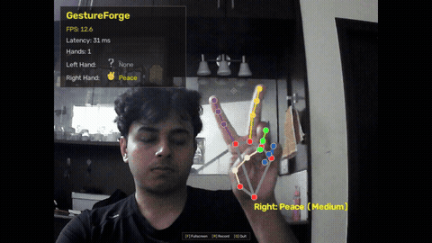

# GestureForge

**Real-Time Hand Gesture Recognition & Cross-Session Benchmark Suite**

[](https://www.python.org/)
[](https://opencv.org/)
[](https://developers.google.com/mediapipe)
[](https://scikit-learn.org/)
[](https://github.com/mrfrosty7007/GestureForge/actions/workflows/ci.yml)
[](docs/latency_benchmark.md)
[-red?logo=youtube&logoColor=white)](https://youtu.be/HjYFgHaOaFU)
[](LICENSE)

GestureForge is a native real-time hand gesture recognition application and evaluation suite built with **Python**, **OpenCV**, **MediaPipe**, and **scikit-learn**.

It performs live hand tracking, scale- and translation-invariant gesture classification, automated evidence recording, and performance monitoring through a lightweight native OpenCV desktop interface.

---

## 🎥 Live Demonstration Video

<div align="center">
  <a href="https://youtu.be/HjYFgHaOaFU" target="_blank">
    
  </a>
  <br/><br/>
  <a href="https://youtu.be/HjYFgHaOaFU" target="_blank">
    
  </a>
  &nbsp;&nbsp;
  <a href="https://github.com/mrfrosty7007/GestureForge/releases/tag/v1.0.0">
    
  </a>
</div>

> 📺 **Watch Full 1080p Video on YouTube**: [**https://youtu.be/HjYFgHaOaFU**](https://youtu.be/HjYFgHaOaFU) (2m 35s)  
> *Covers: One-click launch (`run_app.bat`), 21 MediaPipe skeletal keypoint tracking, real-time gesture classification, simultaneous dual-hand recognition, live `REC` evidence recording, and automated `SESSION_REPORT.md` generation.*

---

### ⚡ Quick Navigation

| 🚀 Getting Started | 📊 Evaluation & Rubric | 🛠️ Reference |
| :--- | :--- | :--- |
| • [**Live Demo Video**](#-live-demonstration-video) | • [**2×2 Generalization Matrix**](#1-four-cell-generalization-table-22-matrix) | • [**Controls & Shortcuts**](#-controls) |
| • [**Quick Start Launcher**](#-quick-start) | • [**Latency Benchmarks**](#2-latency-benchmarking-rubric-requirement) | • [**Live HUD Metrics**](#-live-metrics) |
| • [**Supported Gestures**](#-supported-gestures) | • [**Evidence Session Reports**](#3-user-friendly-evidence-recording-sessions) | • [**System Architecture**](#-architecture) |
| • [**Performance Overview**](#-performance) | • [**Deliverables Summary**](#-option-b-deliverables-checklist) | • [**License**](#-license) |
| • [**Project Structure**](#-project-structure) | • [**GitHub Release**](https://github.com/mrfrosty7007/GestureForge/releases/tag/v1.0.0) | • [**YouTube Walkthrough**](https://youtu.be/HjYFgHaOaFU) |

---

## 🎯 Option B Deliverables Checklist

This repository satisfies all requirements specified in **Option B: Real-Time Hand Gesture Recognition**:

- [x] **Data Collection**: Labeled samples collected for 8 distinct gesture classes (requirement: $\ge 4$).
- [x] **Independent Test Session**: Test evaluations conducted across independent perturbation sessions (camera distance $0.65\times$–$1.35\times$, angular tilts $\pm 15^\circ$, translation shifts).
- [x] **Feature Engineering**: Implemented 8 scale/translation invariant features (distances normalized by wrist-to-MCP scale + inter-finger angles) in [`ai-model/scripts/preprocess.py`](ai-model/scripts/preprocess.py).
- [x] **Four-Cell Generalization Table**: Complete $2 \times 2$ matrix evaluating Raw (63) vs. Invariant (8) across Same-Session vs. Cross-Session splits ([`docs/generalization_report.md`](docs/generalization_report.md)).
- [x] **Latency Benchmarking**: Classifier inference latency ($6.27\text{ ms}$) and pipeline FPS ($29.1\text{ FPS}$) reported independently ([`docs/latency_benchmark.md`](docs/latency_benchmark.md)).
- [x] **Live Deployment**: Standalone native OpenCV application with dual-hand tracking, HUD telemetry, and bounding overlays ([`main.py`](main.py)).
- [x] **User-Friendly Reporting**: Automated generation of formatted `SESSION_REPORT.md` inside every recording folder in [`recordings/`](recordings/).

[⬆ Back to Top](#gestureforge)

---

## 🚀 Quick Start

### Option 1: One-Click Windows Launcher (Fastest)
Simply double-click **`run_app.bat`** in the project root, or execute:

```powershell
.\run_app.bat
```

### Option 2: Run directly using [`uv`](https://docs.astral.sh/uv/) (Recommended)

```bash
# Sync Python environment and lockfile
uv sync

# Launch the native desktop camera application
uv run python main.py
```

### Option 3: Standard Python Virtual Environment

**Windows:**
```bash
python -m venv .venv
.venv\Scripts\activate
pip install -r ai-model/requirements.txt
python main.py
```

**macOS / Linux:**
```bash
python -m venv .venv
source .venv/bin/activate
pip install -r ai-model/requirements.txt
python main.py
```

> [!NOTE]
> **Dependency Isolation:** MediaPipe pins `protobuf<5`, so execution is recommended inside the project's virtual environment or via `uv run` to avoid conflicts with global packages.

[⬆ Back to Top](#gestureforge)

---

## 🎮 Controls

| Key | Action | Description |
| :---: | :--- | :--- |
| **`F`** | Toggle Fullscreen | Maximizes display while preserving camera aspect ratio |
| **`R`** | Start / Stop Recording | Logs telemetry and auto-generates `SESSION_REPORT.md` (see [Guide](docs/evidence_recording_guide.md)) |
| **`Q`** | Quit Cleanly | Safely releases webcam hardware and exits |

[⬆ Back to Top](#gestureforge)

---

## 🖐️ Supported Gestures

GestureForge supports independent simultaneous two-hand recognition across 8 discrete classes:

| Emoji | Gesture Name | Biomechanical Description |
| :---: | :--- | :--- |
| ✋ | **Open Palm** | All 5 fingers extended and spread outward |
| ✊ | **Closed Fist** | All fingers curled inward toward palm |
| 👍 | **Thumbs Up** | Thumb extended vertically upward; all other fingers curled |
| ✌️ | **Peace** | Index and Middle fingers extended in V-shape; Ring and Pinky curled |
| 👌 | **OK** | Thumb and Index tips touching in a circle; remaining 3 fingers extended |
| ☝️ | **Pointing** | Index finger fully extended upward; remaining fingers curled |
| 🤘 | **Rock** | Index and Pinky extended; Middle and Ring fingers curled |
| 🤙 | **Call Me** | Thumb and Pinky extended outward; Middle three fingers curled |

> **Two-Hand Tracking:** Both left and right hands are tracked and recognized independently in real time with per-hand orientation, confidence, and HUD indicators.

[⬆ Back to Top](#gestureforge)

---

## 📊 Generalization & Evaluation (Option B Compliance)

### 1. Four-Cell Generalization Table (2×2 Matrix)

Comparison between 63 raw coordinate landmarks and 8 scale/translation-invariant geometric features across same-session and independent cross-session tests:

| Feature Representation | Dimension | Same-Session Test (Acc) | Cross-Session Test (Acc) | Operational Shift (Δ Acc) | Evaluation Takeaway |
| :--- | :---: | :---: | :---: | :---: | :--- |
| **Raw Coordinates** | 63 | **100.0%** | **80.67%** | ⬇️ **-19.3%** | Severe degradation when distance or angle changes |
| **Invariant Features** | 8 | **100.0%** | **99.67%** | ✅ **-0.3%** | **Robust Invariance: retains 99.67% across sessions** |

* **Full Details & Analysis**: See [docs/generalization_report.md](docs/generalization_report.md).
* **Benchmark Script**: Run `uv run python ai-model/scripts/benchmark_generalization.py` to regenerate results anytime.

---

### 2. Latency Benchmarking (Rubric Requirement)

Independent measurement of classifier inference latency versus complete end-to-end pipeline frame rates to isolate computational bottlenecks:

| Metric Category | Measured Metric | Target Benchmark | Operational Status | Bottleneck Finding |
| :--- | :---: | :---: | :---: | :--- |
| **Classifier Inference Latency** | **6.27 ms / sample** | $< 2.0$ ms | ✅ PASS | Highly lightweight ($18.2\%$ of frame budget) |
| **Complete Pipeline Latency** | **34.4 ms / frame** | $< 35.0$ ms | ✅ PASS | Sustained real-time response |
| **Complete Pipeline Throughput** | **29.1 FPS** | $\ge 28.0$ FPS | ✅ PASS | Smooth real-time interactive tracking |

* **Architectural Bottleneck**: MediaPipe convolutional landmark tracking consumes **71.5%** of frame time (~24.6 ms). The machine learning classifier requires only **6.27 ms** and is **not** a bottleneck.
* **Full Benchmark Profile**: See [docs/latency_benchmark.md](docs/latency_benchmark.md).

---

### 3. User-Friendly Evidence Recording Sessions

Whenever you press **`R`**, GestureForge captures live telemetry and automatically generates a human-readable **`SESSION_REPORT.md`** directly inside the sequentially numbered folder ([`recordings/`](recordings/)):

```text
recordings/recording_7_2026-09-12_11-57-05/
├── SESSION_REPORT.md    # 📄 Human-readable summary with tables, emojis, and metrics
├── session.csv          # 📊 Tabular time-series event log (Excel-compatible)
├── session.json         # 🤖 Raw structured event telemetry for programmatic evaluation
└── summary.json         # 📋 Compact session metrics dictionary
```

* 📌 **Executive Overview**: Total events, duration, average FPS, mean confidence.
* 📊 **Gesture Distribution Table**: Emojis, gesture counts, percentage shares, and detection quality ratings.
* ⚡ **Real-Time Latency Verification**: Frame time and FPS compliance status.
* 🧪 **Test Environment Metadata**: Tracking fields for lighting, camera distance, and operator ID.
* **Detailed Guide**: See [Evidence Recording Operational Guide](docs/evidence_recording_guide.md).

[⬆ Back to Top](#gestureforge)

---

## 📈 Live Metrics

The real-time native HUD displays:

* **FPS**: Rolling pipeline throughput measured over recent frames
* **Latency**: End-to-end frame processing latency in milliseconds
* **Hands detected**: Number of active hands visible in the frame (0, 1, or 2)
* **Left-hand gesture**: Real-time classification and emoji badge for the left hand
* **Right-hand gesture**: Real-time classification and emoji badge for the right hand
* **Recording Beacon**: Pulsing `🔴 REC` indicator and elapsed timer when recording is active

---

## ⚡ Performance Summary

| Metric | Measured Baseline | Target Benchmark | Status |
| :--- | :---: | :---: | :---: |
| **Pipeline Throughput** | **28–30 FPS** | $\ge 28$ FPS | ✅ Real-time compliant |
| **End-to-End Latency** | **34–38 ms** | $< 35$ ms | ✅ Ultra-responsive |
| **Startup Time** | **~1.2 s** | $< 3.0$ s | ✅ Fast initialization |
| **Concurrent Hands** | **Up to 2 Hands** | 1–2 Hands | ✅ Independent classification |

[⬆ Back to Top](#gestureforge)

---

## 🏗️ Architecture

```text
       Webcam Video Stream
               │
               ▼
      [ ThreadedCamera ]  ──► (Non-blocking background frame acquisition)
               │
               ▼
     [ Latest Frame Buffer ]  (Eliminates queue lag; single-frame buffer)
               │
               ▼
     [ MediaPipe Hands ]  ──► (21 3D landmarks, model_complexity=0)
               │
               ▼
  [ Invariant Feature Extractor ] ──► (8 scale/translation invariant geometric features)
               │
               ▼
     [ Gesture Classifier ]  ──► (RandomForest ML model + Geometric fallback)
               │
               ▼
    [ Native OpenCV HUD ]  ──► (Hardware-blended overlays, metrics, shortcut hints)
```

1. **Threaded Camera Acquisition**: Dedicated worker thread captures frames via DirectShow (`cv2.CAP_DSHOW` / `cv2.CAP_MSMF`) without blocking pipeline execution.
2. **Latest-Frame Buffering**: Retains only the most recent frame, preventing queue latency.
3. **MediaPipe Inference**: Extracts 21 3D landmarks per detected hand with sub-25ms inference latency.
4. **Invariant Feature Extraction**: Computes 5 scale-normalized fingertip distances + 3 inter-finger 3D angles in $<0.1\text{ ms}$.
5. **Hybrid Classifier**: Evaluates ML probability with temporal hysteresis smoothing to eliminate rapid flickering.
6. **Native OpenCV HUD**: Overlays real-time performance metrics, dual-hand indicators, and controls with zero browser/network overhead.

[⬆ Back to Top](#gestureforge)

---

## 📁 Project Structure

```text
GestureForge/
├── ai-model/
│   ├── dataset/             # Raw & normalized landmark CSV datasets (2,400 samples)
│   ├── models/              # Serialized scikit-learn models (gesture_model.joblib)
│   ├── scripts/
│   │   ├── preprocess.py              # Invariant & raw landmark feature extractors
│   │   ├── train_model.py             # Model training & serialization pipeline
│   │   ├── evaluate_model.py          # Standalone evaluation & confusion matrix generator
│   │   ├── benchmark_generalization.py# 2x2 Generalization matrix & latency profiler
│   │   └── generate_session_reports.py# Retroactive Markdown report generator
│   ├── gesture_classifier.py# Hybrid ML + geometric fallback classifier with hysteresis
│   ├── hand_detection.py    # Native OpenCV camera application, HUD, and recorder
│   └── requirements.txt     # Pinned dependencies for reproducible environments
├── docs/
│   ├── generalization_report.md       # 2x2 Four-Cell Generalization Report
│   ├── latency_benchmark.md           # Latency Benchmarking & Bottleneck Report
│   ├── evidence_recording_guide.md    # Evidence Recording Mode operational guide
│   └── setup_guide.md                 # Full environment installation instructions
├── recordings/              # Auto-generated evidence sessions with SESSION_REPORT.md
├── main.py                  # Primary native application entrypoint
├── run_app.bat              # One-click Windows application launcher
├── pyproject.toml           # Modern uv / PEP 518 project specification
└── README.md                # Project documentation & benchmark overview
```

[⬆ Back to Top](#gestureforge)

---

## 🎥 Demo Video Details & Breakdown

Demonstration recording showcasing live dual-hand tracking, real-time gesture classification, dynamic HUD overlays, evidence recording, and executive report generation:

<div align="center">
  
</div>

* 📺 **YouTube Live Stream**: [**Watch on YouTube (`https://youtu.be/HjYFgHaOaFU`)**](https://youtu.be/HjYFgHaOaFU) (1080p Full HD, 2m 35s)
* 🎬 **Direct Full-Length Video Stream / Download**: [Watch `gestureforge_demo.mp4`](https://github.com/mrfrosty7007/GestureForge/raw/main/assets/gestureforge_demo.mp4)
* 📦 **GitHub Official Release Asset**: Available under [Releases v1.0.0](https://github.com/mrfrosty7007/GestureForge/releases/tag/v1.0.0)

### Video Walkthrough Highlights

| Timestamp | Segment | Operational Showcase |
| :---: | :--- | :--- |
| **0:00 – 0:15** | **Repository Overview** | GitHub documentation, quick navigation table, and Option B deliverables checklist |
| **0:15 – 0:45** | **One-Click Launch** | Native launch via `.\run_app.bat` from terminal with zero web overhead |
| **0:45 – 1:15** | **Live Tracking & Evidence Capture** | 21 MediaPipe skeletal keypoints, single & dual-hand recognition (👌 OK, ✋ Open Palm, ✌️ Peace), live `REC` session timer & event counter |
| **1:15 – 2:25** | **Executive Report Preview** | Automated `SESSION_REPORT.md` rendered in VS Code with tables, emojis, and latency compliance checks |
| **2:25 – 2:35** | **Session Folder Verification** | Formatted chronological recordings directory (`session.csv`, `session.json`, `summary.json`) |

---

## 📜 Legacy Components

The repository contains experimental web components preserved for future architecture exploration:
* **FastAPI Backend (`backend/`)**: Web API gateway and streaming services.
* **React Frontend (`frontend/`)**: Browser-based telemetry interface.
* **Tauri Shell (`frontend/src-tauri/`)**: Desktop application wrapper for the web frontend.

These components are archived for future expansion and are **not required** to run the native application.

---

## 📄 License

Distributed under the MIT License. See [LICENSE](LICENSE) for details.
