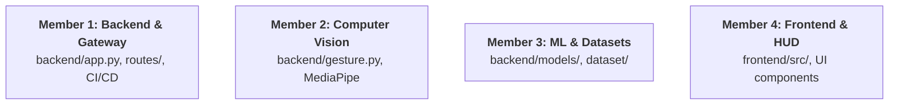

# GestureForge ⚡
> **Real-Time AI-Powered Hand Gesture Recognition Engine**


---

## 📌 Project Overview

**GestureForge** is a modern, low-latency computer vision and machine learning platform designed to translate human hand gestures into digital commands in real time. Using standard consumer webcams, GestureForge extracts 3D hand keypoints with sub-millimeter precision, maps them to coordinate invariant feature vectors, classifies target gestures using trained machine learning models, and visualizes the telemetry through an interactive, cyberpunk-inspired web HUD.

Built as an evaluation and club selection flagship project, GestureForge emphasizes modular software engineering, clean code decoupling, automated testing, and seamless team collaboration across four specialized domains.

---

## 🛑 Problem Statement

Touchless interaction and accessible human-computer interfaces (HCI) are essential in modern computing environments—including sterile medical operating rooms, immersive gaming, VR/AR, smart classroom presentations, and accessibility aids for users with limited mobility. 

However, many existing gesture systems:
1. **Require expensive specialized hardware** (e.g., Leap Motion or depth cameras).
2. **Suffer from high latency and lag** when streaming frames over bloated HTTP networks.
3. **Lack modular architecture**, making team collaboration and testing difficult.

**GestureForge solves this** by running on lightweight consumer hardware via Google MediaPipe and Scikit-learn, exposed through high-speed asynchronous FastAPI services and rendered in a modern React + Vite HUD.

---

## ✨ Planned Features

- 🖐️ **21 3D Hand Landmark Tracking**: High-fidelity keypoint extraction per hand powered by Google MediaPipe.
- ⚡ **Sub-35ms Latency Budget**: Optimized frame ingestion pipeline delivering smooth 60 FPS feedback.
- 🧠 **Machine Learning Classification**: Trained multi-class classifier recognizing 8 distinct hand gestures with confidence scoring.
- 🖥️ **Futuristic Cyberpunk HUD**: Glassmorphic dashboard displaying live camera feeds, bounding reticles, confidence meters, and connection health diagnostics.
- 👥 **Four-Member Independent Architecture**: Decoupled modules allowing four engineers to develop, test, and ship in parallel.
- 🛡️ **Production-Ready Quality**: Formatted with Black and Prettier, linted with ESLint, validated via GitHub Actions CI.

---

## 🛠️ Tech Stack

| Layer | Technology | Purpose |
|:---|:---|:---|
| **Frontend** | React + Vite | Reactive user interface, camera feed capture, and HUD visualization |
| **Backend Gateway** | Python + FastAPI + Uvicorn | Asynchronous REST and WebSocket API gateway |
| **Computer Vision (Phase 1)** | Google MediaPipe + OpenCV | Frame ingestion, hand landmark detection, skeleton rendering |
| **Machine Learning (Phase 2)**| Scikit-learn + NumPy | Feature normalization and multi-class gesture classification |
| **Code Quality** | Black, ESLint, Prettier, Pytest | Automated formatting, static analysis, and regression testing |
| **CI / CD** | GitHub Actions | Automated build, test, and startup verification on every PR |

---

## 📂 Project Structure

```
GestureForge/
├── backend/
│   ├── app.py                      # FastAPI gateway entrypoint & CORS configuration
│   ├── gesture.py                  # MediaPipe hand tracking & landmark scaffolding
│   ├── config.py                   # Environment settings & parameters
│   ├── requirements.txt            # Python dependencies (FastAPI, OpenCV, MediaPipe, etc.)
│   ├── .env.example                # Backend environment template
│   ├── routes/
│   │   ├── __init__.py
│   │   └── health.py               # GET /health endpoint
│   ├── models/
│   │   ├── __init__.py
│   │   └── gesture_model.py        # Scikit-learn classification model scaffolding
│   └── tests/
│       ├── __init__.py
│       └── test_health.py          # Pytest suite for gateway & health checks
├── frontend/
│   ├── index.html                  # HTML entrypoint with modern viewport & fonts
│   ├── package.json                # Frontend dependencies & scripts
│   ├── vite.config.js              # Vite bundler configuration
│   ├── eslint.config.js            # ESLint static code analysis
│   ├── .prettierrc                 # Prettier code formatting standards
│   ├── .env.example                # Frontend environment template
│   └── src/
│       ├── main.jsx                # React root mount
│       ├── App.jsx                 # Main application dashboard
│       ├── index.css               # Design system & dark mode aesthetics
│       └── components/
│           ├── Header.jsx          # Futuristic brand header & status badge
│           ├── StatusCard.jsx      # Live backend ping & connectivity card
│           └── CameraPlaceholder.jsx # Camera viewfinder HUD with radar reticles
├── dataset/
│   ├── README.md                   # Dataset collection guidelines & taxonomy
│   ├── raw/                        # Raw video samples (.gitkeep)
│   └── processed/                  # Normalized landmark CSV arrays (.gitkeep)
├── docs/
│   ├── architecture.md             # System architecture & data flow diagrams
│   ├── setup_guide.md              # Cross-platform installation instructions
│   ├── team_roles.md               # 4-Member responsibility matrix & contracts
│   └── roadmap.md                  # Milestone delivery roadmap
├── .github/
│   ├── ISSUE_TEMPLATE/
│   │   ├── bug_report.md           # Standardized bug reporting
│   │   └── feature_request.md      # Feature request template
│   ├── PULL_REQUEST_TEMPLATE.md    # Multi-member PR checklist
│   └── workflows/
│       └── ci.yml                  # Automated GitHub Actions workflow
├── pyproject.toml                  # Black formatting & Pytest configuration
├── README.md                       # Master project documentation
├── LICENSE                         # MIT License
└── .gitignore                      # Python, Node, OS, and dataset exclusions
```

---

## 🚀 Local Setup & Quickstart

### Prerequisites
- Python 3.10+ (`python --version`)
- Node.js 18+ (`node --version`)
- Git (`git --version`)

---

### 1. Backend Setup

```bash
# Navigate to backend directory
cd backend

# Create and activate virtual environment
python -m venv .venv

# On Windows:
.venv\Scripts\Activate.ps1
# On macOS/Linux:
source .venv/bin/activate

# Install dependencies
pip install -r requirements.txt

# Copy environment variables
cp .env.example .env

# Run development server
uvicorn app:app --reload
```
> The API will be available at: **`http://127.0.0.1:8000`**  
> Test the health check at: **`http://127.0.0.1:8000/health`**  
> Interactive OpenAPI documentation: **`http://127.0.0.1:8000/docs`**

---

### 2. Frontend Setup

```bash
# Open a new terminal and navigate to frontend directory
cd frontend

# Install Node dependencies
npm install

# Copy environment variables
cp .env.example .env

# Run development server
npm run dev
```
> The client dashboard will launch at: **`http://localhost:5173`**

---

## 👥 4-Member Team Workflow

To enable four engineers to work in parallel without blocking each other, ownership is divided into clear functional slices:



- **Member 1 (Backend & API)**: Owns FastAPI server, `/health` route, WebSocket frame transport, and CI/CD pipelines.
- **Member 2 (Computer Vision)**: Owns `backend/gesture.py`, MediaPipe hands detection, and coordinate extraction.
- **Member 3 (ML Model & Datasets)**: Owns `backend/models/gesture_model.py`, data recording, coordinate normalization, and Scikit-learn training.
- **Member 4 (Frontend UI & HUD)**: Owns React dashboard, camera canvas stream, telemetry HUD, and styling.

For detailed interface definitions, consult [`docs/team_roles.md`](docs/team_roles.md).

---

## 🌿 Git Branching Strategy

We follow an adapted GitHub Flow to protect `main`:

```
main (Production / Stable)
 └── develop (Staging & Integration)
      ├── feat/backend-websocket-m1
      ├── feat/mediapipe-landmarks-m2
      ├── feat/classifier-training-m3
      └── feat/frontend-hud-m4
```

1. Create a feature branch off `develop`:
   ```bash
   git checkout -b feat/<module-name>-<member-initials>
   ```
2. Make commits following Conventional Commits format (`feat:`, `fix:`, `docs:`, `chore:`).
3. Open a Pull Request using `.github/PULL_REQUEST_TEMPLATE.md`.
4. Ensure all CI checks pass and obtain at least 1 team peer review before merging.

---

## 🗺️ Future Roadmap

- [x] **Phase 0: Foundation & Planning** (Current)
  - Scaffolding, `/health` endpoint, React landing page, GitHub CI, documentation.
- [ ] **Phase 1: Perception & Frame Ingestion**
  - Webcam feed streaming, MediaPipe 21 hand landmarks detection, skeleton overlays.
- [ ] **Phase 2: Model Training & Gesture Classification**
  - 8-gesture dataset collection, normalization, Scikit-learn model training.
- [ ] **Phase 3: Real-Time HUD, Sound & Polishing**
  - Interactive telemetry overlay, audio cues, macro trigger events, club showcase deck.

See [`docs/roadmap.md`](docs/roadmap.md) for full milestone details.

---

## 📄 License

This project is licensed under the MIT License - see the [LICENSE](LICENSE) file for details.
