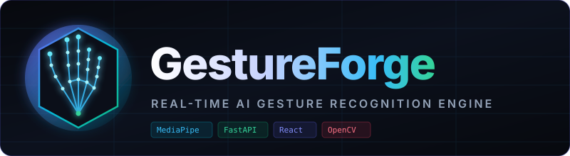
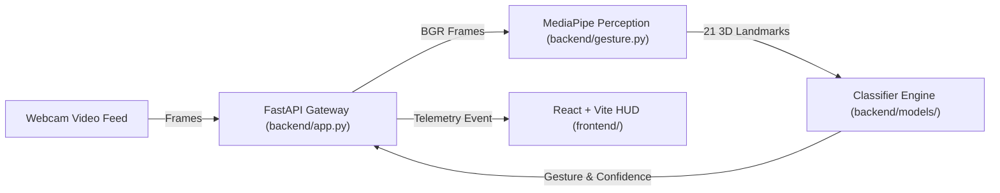

<p align="center">
  
</p>

<h1 align="center">GestureForge</h1>

<p align="center">
  <strong>Real-time AI-powered Hand Gesture Recognition using MediaPipe, FastAPI, and React.</strong>
</p>

<p align="center">
  <a href="https://github.com/your-org/GestureForge/actions"></a>
  
  
  
  
  
  
  
  
  <a href="LICENSE"></a>
</p>

---

## 🛑 Problem Statement

Touchless human-computer interaction (HCI) is critical in modern digital environments—from sterile operating rooms and VR gaming to accessibility tools for motor-impaired individuals.

Traditional systems either rely on expensive, proprietary sensor hardware (such as specialized depth cameras) or suffer from high network latency and monolithic architectures. **GestureForge** solves this through an open, modular pipeline: capturing consumer webcam feeds, extracting 21 3D hand keypoints via Google MediaPipe, classifying gestures in sub-millisecond time via Scikit-learn, and streaming real-time telemetry into a cyberpunk React HUD.

---

## ✨ Features

- 🖐️ **21 3D Hand Landmark Tracking**: Sub-millimeter keypoint extraction using Google MediaPipe.
- ⚡ **Sub-35ms Latency Budget**: High-throughput asynchronous streaming between browser and backend.
- 🧠 **ML Gesture Classification**: Multi-class model recognizing 8 core gestures with confidence telemetry.
- 🖥️ **Futuristic Cyberpunk HUD**: Glassmorphic dashboard with live health diagnostics and radar reticles.
- 👥 **Decoupled Team Architecture**: Clear API contracts tailored for 4 independent contributors.
- 🛡️ **Production-Grade Quality**: Enforced with Ruff, Black, ESLint, Prettier, and GitHub Actions CI.

---

## 🏛️ Architecture Preview



> 📖 **Deep Dive**: See [`docs/architecture.md`](docs/architecture.md) for full pipeline specs and latency budgets.

---

## 🚀 Quick Start (3 Commands)

Get GestureForge up and running locally in seconds:

```bash
# 1. Clone repo & sync Python environment (via uv)
git clone https://github.com/your-org/GestureForge.git && cd GestureForge && uv sync

# 2. Start the FastAPI Backend Gateway
uv run uvicorn app:app --reload

# 3. Start the React Frontend Dashboard (in a second terminal)
cd frontend && pnpm install && pnpm run dev
```

- **Frontend Dashboard**: [`http://localhost:5173`](http://localhost:5173)
- **Backend API & Health**: [`http://127.0.0.1:8000/health`](http://127.0.0.1:8000/health)
- **Interactive Swagger Docs**: [`http://127.0.0.1:8000/docs`](http://127.0.0.1:8000/docs)

*(Note: Traditional `pip install -r backend/requirements.txt` and `npm run dev` are also fully supported).*

---

## 👥 4-Member Team Ownership

GestureForge separates responsibilities so 4 engineers can ship features simultaneously:

| Member | Specialization | Core Files | Delivered Interface |
|:---|:---|:---|:---|
| **Member 1** | Backend & API Gateway | `backend/app.py`, `backend/routes/` | `/health`, WebSocket streaming gateway |
| **Member 2** | Computer Vision & Perception | `backend/gesture.py` | `extract_landmarks(frame) -> list[HandDetectionResult]` |
| **Member 3** | ML Models & Datasets | `backend/models/`, `dataset/` | `predict(features) -> {"gesture": str, "confidence": float}` |
| **Member 4** | Frontend UI & HUD | `frontend/src/` | Interactive telemetry HUD & camera viewports |

> 👥 **Team Contract**: Review [`docs/team_roles.md`](docs/team_roles.md) for the complete collaboration and branching matrix.

---

## 🗺️ Project Roadmap

| Phase | Milestone | Deliverables | Status |
|:---|:---|:---|:---|
| **Phase 0 & 0.5** | **Foundation, Tooling & Polish** | FastAPI `/health`, React HUD, uv, Ruff, Black, CI/CD, documentation | **Completed** ✅ |
| **Phase 1** | **Perception & Frame Ingestion** | Webcam feed, WebSocket stream, MediaPipe 21 hand landmarks | *Next Up* 🚀 |
| **Phase 2** | **ML Classification Engine** | 8-gesture dataset, coordinate normalization, Scikit-learn classifier | *Planned* 🧠 |
| **Phase 3** | **Polishing, HUD & Presentation** | Interactive telemetry overlay, sound cues, showcase presentation | *Planned* 🎨 |

> 🗺️ **Milestones**: Detailed breakdown available in [`docs/roadmap.md`](docs/roadmap.md).

---

## 📚 Detailed Documentation

Comprehensive specifications are organized into dedicated documents:

- 🏛️ [**System Architecture & Data Flow**](docs/architecture.md) — Technical component breakdown & latency budgets.
- 🛠️ [**Setup & Installation Guide**](docs/setup_guide.md) — Detailed instructions for Windows, macOS, and Linux with `uv`.
- 👥 [**Team Roles & Branching Guide**](docs/team_roles.md) — 4-member responsibility matrix and Git workflow.
- 🗺️ [**Development Roadmap**](docs/roadmap.md) — 4-phase agile milestones and deliverable criteria.
- 📊 [**Dataset Taxonomy & Schema**](dataset/README.md) — 8-class gesture catalog and landmark normalization formulas.
- 📋 [**Project Changelog**](CHANGELOG.md) — Historical release and milestone notes.
- 🎨 [**Social Preview Specs**](assets/social_preview.md) — OpenGraph banner guidelines and color tokens.

---

## 📄 License

This project is licensed under the MIT License - see the [LICENSE](LICENSE) file for details.
