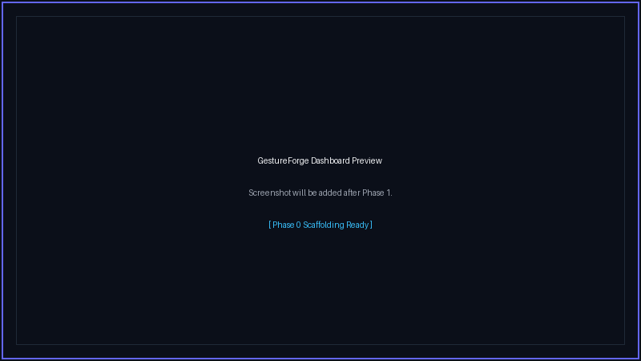
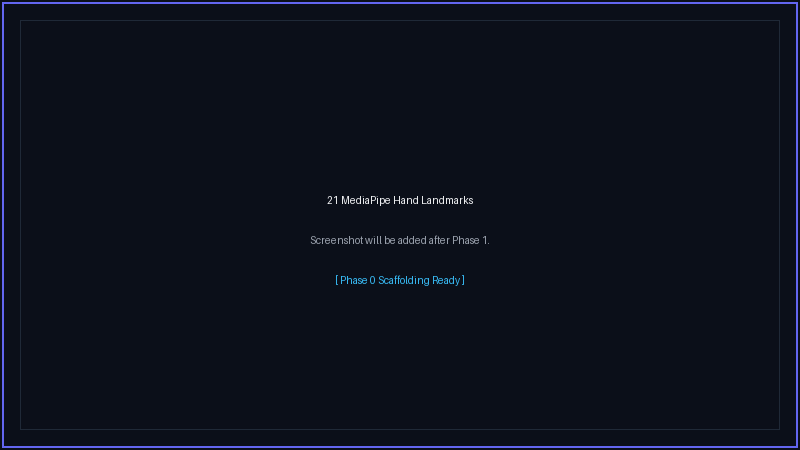
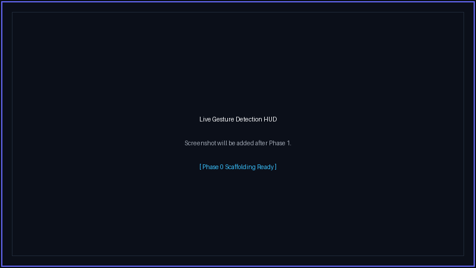
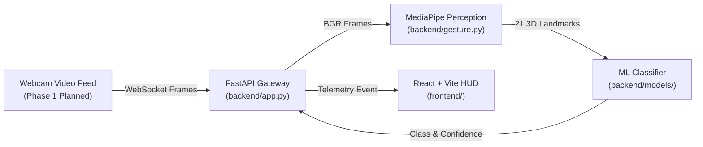

<p align="center">
  
</p>

<h1 align="center">GestureForge</h1>

<p align="center">
  <strong>Real-time AI-powered Hand Gesture Recognition using MediaPipe, FastAPI, and React.</strong>
</p>

<p align="center">
  <a href="https://github.com/mrfrosty7007/GestureForge/actions"></a>
  
  
  
  
  
  
  
  
  <a href="LICENSE"></a>
</p>

<p align="center">
  <em>Currently in Phase 0 — Foundation Complete</em>
</p>

<div align="center">

| Phase 0 (Foundation) | Phase 1 (Perception) | Phase 2 (Classification) | Phase 3 (HUD Polish) |
|:---:|:---:|:---:|:---:|
| ✅ **Complete** | ⏳ **In Progress** | ⏳ **Planned** | ⏳ **Planned** |

</div>

---

## 🛑 Problem Statement

Touchless human-computer interaction (HCI) is essential in sterile healthcare environments, gaming, and accessibility tools for motor-impaired individuals.

Traditional gesture recognition setups often depend on bulky, expensive hardware or suffer from monolithic software designs that hinder team collaboration. **GestureForge** addresses this through an open, decoupled pipeline: combining a lightweight asynchronous FastAPI gateway, Google MediaPipe perception, Scikit-learn gesture classification, and a modern cyberpunk React HUD.

---

## 📊 Current Project State & Capabilities

### ✅ Completed in Phase 0 (Current State)
- **FastAPI Gateway**: Asynchronous backend with structured logging, request timing middleware, and CORS configuration.
- **Health Diagnostics**: Operational `/health` endpoint returning service status and identity.
- **Typed Scaffolding**: Contract interfaces prepared for MediaPipe hand tracking (`backend/gesture.py`) and classifier inference (`backend/models/gesture_model.py`).
- **React + Vite Dashboard**: Dark cyberpunk HUD featuring live gateway health pinging, latency metrics, and an offline recovery command box.
- **Tooling & CI/CD**: Automated GitHub Actions workflow testing on Ubuntu with `uv`, Ruff, Black, Pytest, ESLint, and Prettier.
- **Security & Hygiene**: Sealed environment variables (`.env` ignored, `.env.example` committed).

### 🚀 Planned Capabilities (Upcoming Milestones)
- **Phase 1 (Perception & Live Stream)**: Browser webcam capture via `getUserMedia()`, bidirectional WebSocket frame transport, 21 3D hand landmark tracking, and real-time skeleton overlay.
- **Phase 2 (Machine Learning Engine)**: Normalized coordinate feature engineering, 8-class gesture taxonomy training with Scikit-learn, and real-time confidence scoring.
- **Phase 3 (HUD Polish & Presentation)**: Interactive telemetry dashboard, audio/visual cues, gesture macro triggers, and club selection presentation deck.

---

## 📸 Interface Previews & Screenshots

### Dashboard Viewport (Phase 0 Scaffold)
> *Screenshot will be added after Phase 1.*
<p align="center">
  
</p>

<p align="center">
  <em>Left: Live Camera HUD Viewport • Right: Real-time Gateway Connectivity Diagnostic Card</em>
</p>

### Hand Tracking & Landmark Perception (Phase 1 Target)
> *Screenshot will be added after Phase 1.*
<p align="center">
  
</p>

### Real-Time Gesture Classification (Phase 2 Target)
> *Screenshot will be added after Phase 1.*
<p align="center">
  
</p>

---

## 🏛️ Architecture Preview



> 📖 **Deep Dive**: Consult [`docs/architecture.md`](docs/architecture.md) for full pipeline specs and latency budgets.

---

## 🚀 Quick Start (Tested Commands)

### 1. Clone & Sync Dependencies
```bash
git clone https://github.com/mrfrosty7007/GestureForge.git
cd GestureForge
uv sync
```

### 2. Start the Backend Gateway
```bash
cd backend
uv run uvicorn app:app --reload
```
- **API Base**: [`http://127.0.0.1:8000`](http://127.0.0.1:8000)
- **Health Check**: [`http://127.0.0.1:8000/health`](http://127.0.0.1:8000/health)
- **Swagger Documentation**: [`http://127.0.0.1:8000/docs`](http://127.0.0.1:8000/docs)

### 3. Start the Frontend Dashboard (in a second terminal)
```bash
cd frontend
pnpm install
pnpm run dev
```
- **Client Dashboard**: [`http://localhost:5173`](http://localhost:5173)

*(Note: Traditional `pip install -r backend/requirements.txt` and `npm run dev` are also fully supported).*

---

## 👥 4-Member Team Ownership

GestureForge separates responsibilities so four developers can build concurrently without merge conflicts:

| Member | Specialization | Core Files | Delivered Interface |
|:---|:---|:---|:---|
| **Member 1** | Backend & API Gateway | `backend/app.py`, `backend/routes/` | `/health`, WebSocket streaming gateway |
| **Member 2** | Computer Vision & Perception | `backend/gesture.py` | `extract_landmarks(frame) -> list[HandDetectionResult]` |
| **Member 3** | ML Models & Datasets | `backend/models/`, `dataset/` | `predict(features) -> {"gesture": str, "confidence": float}` |
| **Member 4** | Frontend UI & HUD | `frontend/src/` | Interactive telemetry HUD & camera viewports |

> 👥 **Team Contract**: Review [`docs/team_roles.md`](docs/team_roles.md) for the complete collaboration and branching matrix.

---

## 🗺️ Project Roadmap Progress

- **Phase 0: Foundation & Planning** ✅ *(Completed)*
  - FastAPI `/health` endpoint, React HUD dashboard, `uv` environment, Ruff/Black, CI pipeline, documentation.
- **Phase 1: Perception & Frame Ingestion** ⏳ *(Next Up)*
  - Webcam feed streaming, MediaPipe 21 hand landmarks detection, skeleton overlays.
- **Phase 2: ML Classification Engine** ⏳ *(Planned)*
  - Gesture dataset collection, coordinate normalization, Scikit-learn model training.
- **Phase 3: Polishing, Sound & Showcase** ⏳ *(Planned)*
  - Interactive telemetry overlay, sound cues, performance tuning, club showcase slide deck.

> 🗺️ **Milestones**: Detailed breakdown available in [`docs/roadmap.md`](docs/roadmap.md).

---

## 📚 Detailed Documentation

Detailed technical specifications have been moved into dedicated documents:

- 🏛️ [**System Architecture & Data Flow**](docs/architecture.md) — Technical component breakdown & latency budgets.
- 🛠️ [**Setup & Installation Guide**](docs/setup_guide.md) — Detailed instructions for Windows, macOS, and Linux with `uv`.
- 👥 [**Team Roles & Branching Guide**](docs/team_roles.md) — 4-member responsibility matrix and Git workflow.
- 🗺️ [**Development Roadmap**](docs/roadmap.md) — 4-phase agile milestones and deliverable criteria.
- 📊 [**Dataset Taxonomy & Schema**](dataset/README.md) — Planned gesture catalog and landmark normalization formulas.
- 📋 [**Project Changelog**](CHANGELOG.md) — Release history and milestone notes.
- 🎨 [**Social Preview Specs**](assets/social_preview.md) — OpenGraph banner guidelines and color tokens.

---

## 📄 License

This project is licensed under the MIT License - see the [LICENSE](LICENSE) file for details.
