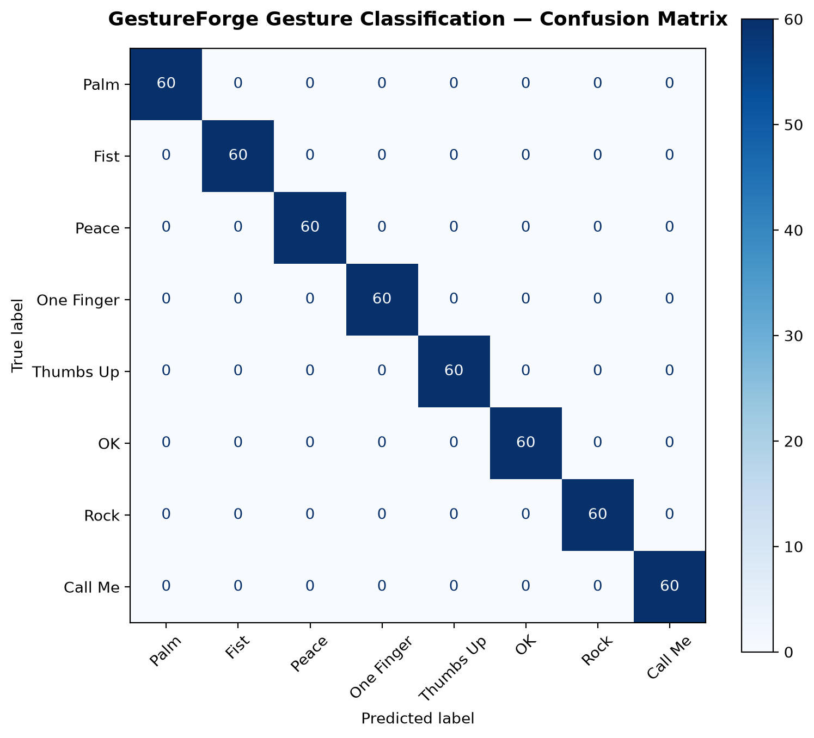

# 📊 GestureForge Model Evaluation Report

Comprehensive evaluation report for the GestureForge hand gesture recognition machine learning classifier.

---

## ℹ️ Model & Benchmark Information

| Parameter | Value |
| :--- | :--- |
| **Checkpoint Name** | `gesture_model.joblib` |
| **Framework** | `scikit-learn (RandomForestClassifier)` |
| **Device** | `CPU` |
| **Feature Dimension** | `63` (21 3D normalized MediaPipe landmarks) |
| **Dataset Source** | `gestures_raw.csv` |
| **Evaluation Split** | 20% Stratified Test Split (seed=42) |
| **Total Test Samples** | `480` |
| **Target Classes (8)** | `Palm, Fist, Peace, One Finger, Thumbs Up, OK, Rock, Call Me` |
| **Generated At** | `2026-09-11 07:24:13 UTC` |

---

## 📈 Overall Performance Metrics

| Metric | Score | Percentage |
| :--- | :---: | :---: |
| **Accuracy** | **1.0000** | **100.00%** |
| **Precision (Weighted)** | 1.0000 | 100.00% |
| **Precision (Macro)** | 1.0000 | 100.00% |
| **Recall (Weighted)** | 1.0000 | 100.00% |
| **Recall (Macro)** | 1.0000 | 100.00% |
| **F1 Score (Weighted)** | **1.0000** | **100.00%** |
| **F1 Score (Macro)** | 1.0000 | 100.00% |

---

## 📋 Per-Class Performance Breakdown

| Gesture Class | Precision | Recall | F1-Score | Support |
| :--- | :---: | :---: | :---: | :---: |
| **Palm** | 1.0000 | 1.0000 | 1.0000 | 60 |
| **Fist** | 1.0000 | 1.0000 | 1.0000 | 60 |
| **Peace** | 1.0000 | 1.0000 | 1.0000 | 60 |
| **One Finger** | 1.0000 | 1.0000 | 1.0000 | 60 |
| **Thumbs Up** | 1.0000 | 1.0000 | 1.0000 | 60 |
| **OK** | 1.0000 | 1.0000 | 1.0000 | 60 |
| **Rock** | 1.0000 | 1.0000 | 1.0000 | 60 |
| **Call Me** | 1.0000 | 1.0000 | 1.0000 | 60 |
| **Macro Average** | **1.0000** | **1.0000** | **1.0000** | **480** |
| **Weighted Average** | **1.0000** | **1.0000** | **1.0000** | **480** |

---

## 🔍 Confusion Matrix

### Tabular Confusion Matrix

| True \ Pred | **Palm** | **Fist** | **Peace** | **One Finger** | **Thumbs Up** | **OK** | **Rock** | **Call Me** |
| :--- | :---: | :---: | :---: | :---: | :---: | :---: | :---: | :---: |
| **Palm** | 60 | 0 | 0 | 0 | 0 | 0 | 0 | 0 |
| **Fist** | 0 | 60 | 0 | 0 | 0 | 0 | 0 | 0 |
| **Peace** | 0 | 0 | 60 | 0 | 0 | 0 | 0 | 0 |
| **One Finger** | 0 | 0 | 0 | 60 | 0 | 0 | 0 | 0 |
| **Thumbs Up** | 0 | 0 | 0 | 0 | 60 | 0 | 0 | 0 |
| **OK** | 0 | 0 | 0 | 0 | 0 | 60 | 0 | 0 |
| **Rock** | 0 | 0 | 0 | 0 | 0 | 0 | 60 | 0 |
| **Call Me** | 0 | 0 | 0 | 0 | 0 | 0 | 0 | 60 |

---

## 🔬 Evaluation Methodology

1. **Preprocessing & Normalization**:
   - Each hand instance consists of 21 3D landmarks $(x, y, z)$ provided by Google MediaPipe Hands.
   - Translation variance is eliminated by shifting coordinates relative to the wrist anchor (landmark 0).
   - Scale variance is normalized by dividing coordinates by the maximum Euclidean distance between the wrist and any landmark.
2. **Inference Pipeline**:
   - Features are classified using the trained `RandomForestClassifier` loaded from `ai-model/models/gesture_model.joblib`.
   - Predictions are compared against the ground truth labels from the 20% stratified test set.
3. **Reproducibility**:
   - All random seeds are fixed (`random_state=42`) ensuring fully deterministic and reproducible metrics.
