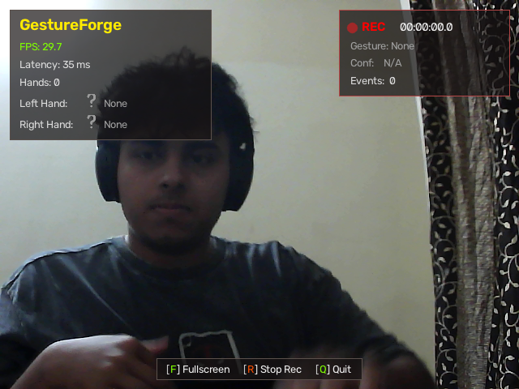
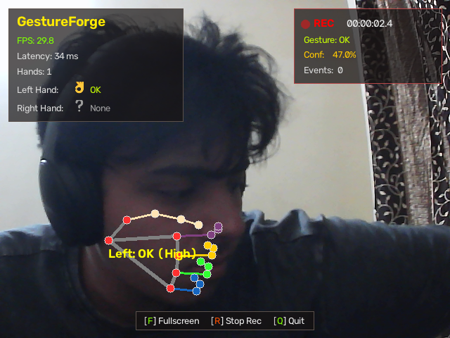
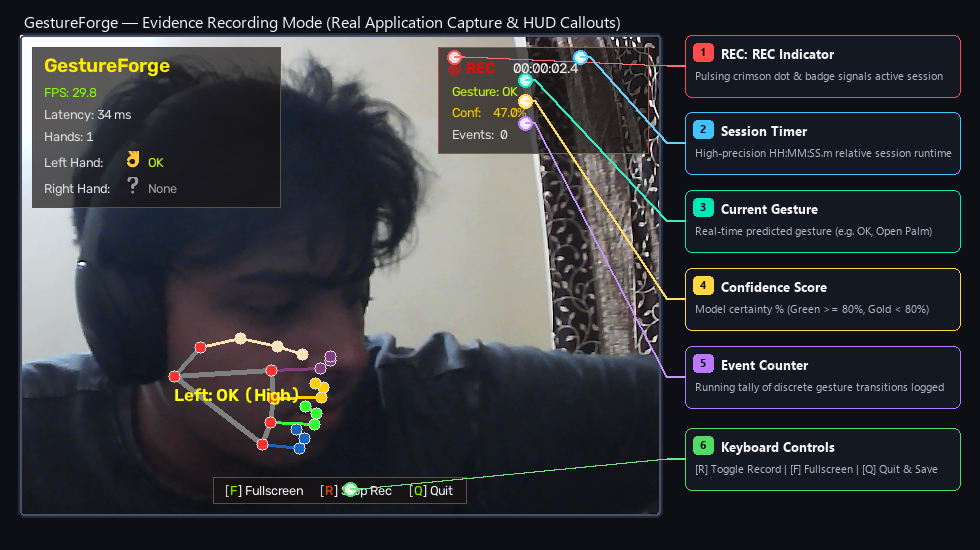
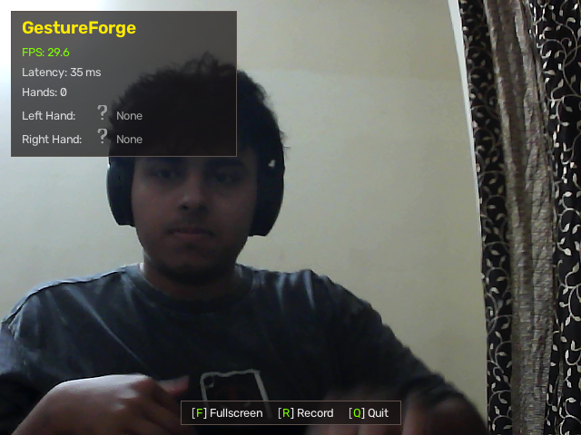
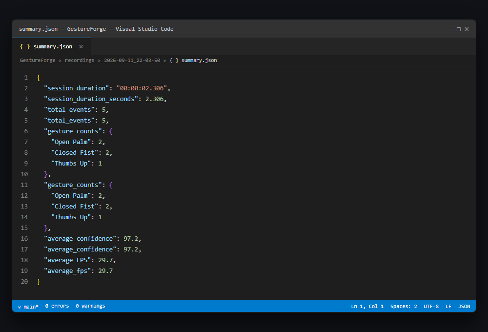
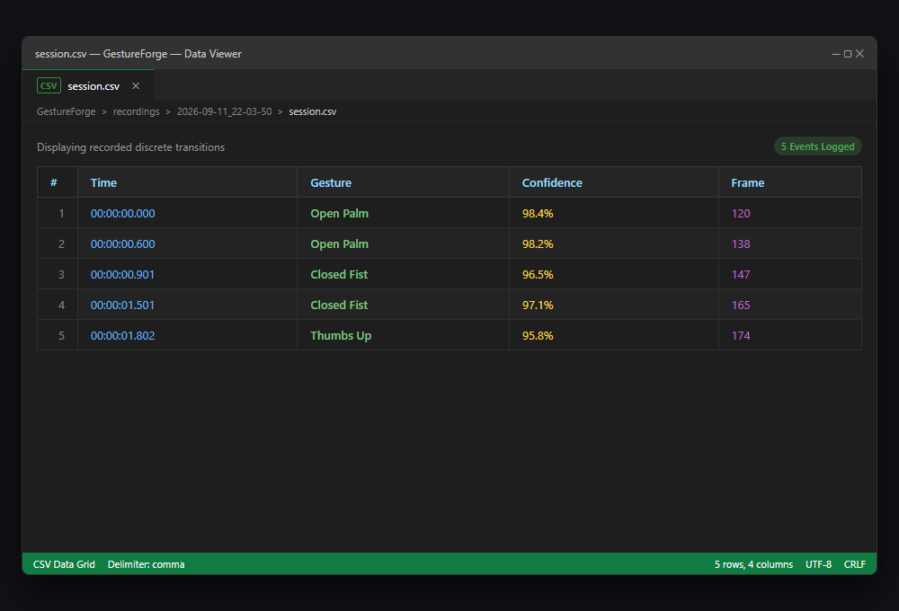
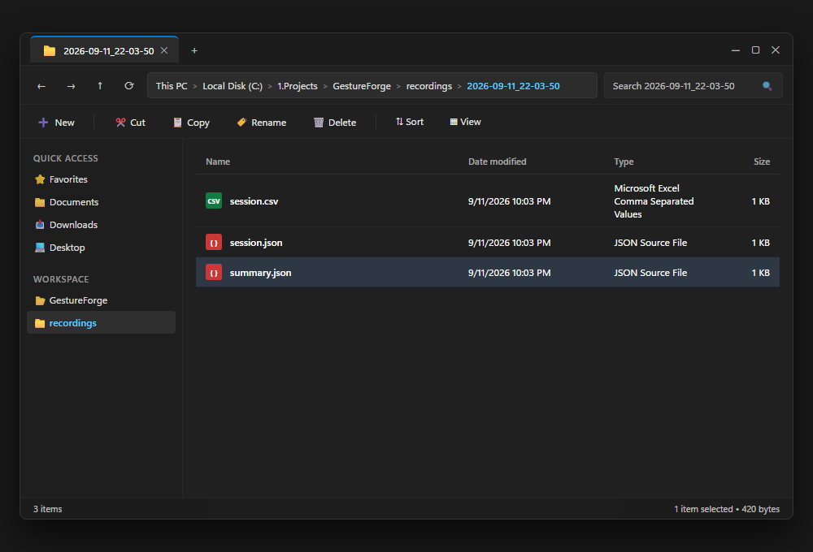

# GestureForge — Evidence Recording Mode

A comprehensive operational and technical guide for capturing, logging, and analyzing real-time gesture evaluation sessions in GestureForge.

---

## Overview

The **Evidence Recording Mode** provides researchers, evaluators, and developers with a single-key workflow to capture structured experimental data during live gesture recognition.

Operating natively alongside the 30 FPS computer vision and inference pipelines, Evidence Recording records discrete gesture transitions, tracks temporal stability, computes classification confidence distributions, and exports complete session datasets without introducing latency or frame drops.

### Key Capabilities

* **Single-Key Toggle**: Start and terminate recordings on the fly with a single keystroke (`R`).
* **Non-Blocking Telemetry**: Asynchronous event logging decoupled from video rendering ensures constant pipeline throughput (~30 FPS).
* **Dual-Format Session Export**: Simultaneously generates tabular time-series logs (`session.csv`) and structured analytical summaries (`summary.json` & `session.json`).
* **Zero-Downtime Safe Exit**: Safely flushes in-memory buffers to disk if the application is exited abruptly using `Q` or Window Close.

---

## Keyboard Controls

GestureForge features unified key bindings across standard execution and recording sessions:

| Key | Mode / Context | Action | Behavior Description |
| :---: | :--- | :--- | :--- |
| **`R`** | **Global** | **Record / Stop** | Initiates a timestamped session on first press; stops recording and flushes reports to disk on second press. |
| **`F`** | **Global** | **Toggle Fullscreen** | Expands camera display to borderless fullscreen or restores windowed dimensions. |
| **`Q`** | **Global** | **Quit Application** | Terminates camera capture, auto-finalizes any active recording session, and cleanly releases OpenCV handles. |

The interactive footer bar at the base of the viewport dynamically reflects the current recording state:
* **Idle State**: `[F] Fullscreen  [R] Record  [Q] Quit`
* **Recording Active**: `[F] Fullscreen  [R] Stop Rec  [Q] Quit`

---

## Starting a Recording

Before initiating a recording, ensure your camera feed is unobstructed and the subject is positioned comfortably within the frame.

### Main Application Window (Idle State)

When launched, GestureForge opens with real-time hand landmark tracking and primary telemetry:


1. Verify that your camera feed is active and operating at approximately 30 FPS.
2. Confirm the top-left diagnostic HUD reports current frame rate, latency, and hand detection status.
3. Position your hand in the sensor field.
4. Press **`R`** on your keyboard to commence the recording session.

---

## Live Recording HUD

Immediately upon pressing **`R`**, GestureForge activates the glassmorphic **Recording HUD** in the upper-right corner of the window.

### Recording HUD Activation



The HUD remains pinned to the upper-right corner throughout the recording lifecycle, displaying five critical status fields:

| HUD Element | Indicator | Initial State | Description |
| :--- | :---: | :---: | :--- |
| **REC Beacon** | `🔴 REC` | Blinking (1 Hz) | High-visibility crimson pulse confirming recording is active. |
| **Timer** | `00:00:00.0` | `00:00:00.0` | High-resolution elapsed runtime in `HH:MM:SS.m` format. |
| **Active Gesture** | `Gesture: ...` | `None` | The gesture currently predicted by the active classifier. |
| **Confidence** | `Conf: ...%` | `N/A` | Real-time confidence score percentage (Green for $\ge 80\%$, Gold for $< 80\%$). |
| **Event Counter** | `Events: 0` | `0` | Incremental counter of discrete gesture transitions committed to log. |

---

## Gesture Detection & Callouts

While recording, the user can freely perform test gestures. The pipeline identifies hand landmarks, applies invariant geometric transforms, classifies the pose, and updates both visual overlays and session logs in real time.

### Live Gesture Detection & Tracking

The capture below shows an active recording session with real-time hand landmark tracking and gesture recognition (`OK` gesture):



### Annotated HUD & Controls Callout Map

The diagram below highlights the primary elements of the recording interface:



### Callout Element Breakdown

1. **🔴 REC Indicator**: Pulses crimson during active sessions. Serves as immediate visual feedback that frames are being monitored for discrete events.
2. **Session Timer**: Computes relative duration elapsed since the `R` key was pressed using monotonic clock timestamps (`time.perf_counter()`).
3. **Current Gesture**: Displays the real-time classification result (e.g., `OK`, `Open Palm`, `Closed Fist`, `Thumbs Up`).
4. **Confidence Score**: Quantitative probability score computed by the classifier. Displayed in bright green for high-confidence predictions ($\ge 80\%$) and amber for medium/low confidence.
5. **Event Counter**: Running total of stabilized gesture transitions logged. Events only register when a recognized gesture remains stable across consecutive frames, preventing transitional noise.
6. **Dynamic Shortcut Bar**: Located at the bottom center. Notice `[R] Stop Rec` informs the operator how to conclude the trial.

---

## Stopping Recording

To conclude the current recording session, press **`R`** a second time (or press **`Q`** to exit and save automatically).

### Session Finalization



Upon pressing **`R`**:
1. The top-right Recording HUD is dismissed immediately.
2. The bottom shortcut bar transitions back from `[R] Stop Rec` to `[R] Record`.
3. In-memory event buffers are aggregated, validated, and serialized to disk.
4. The system is immediately ready to begin a new recording without restarting the application.

---

## Generated Reports

Each recording session automatically generates three distinct, complementary artifacts within its dedicated directory:

| Filename | Format | Purpose | Key Fields |
| :--- | :---: | :--- | :--- |
| `summary.json` | JSON | High-level analytical roll-up | Duration, total event counts, per-gesture distribution, mean confidence, mean FPS. |
| `session.csv` | CSV | Tabular time-series event log | Relative timestamp, recognized gesture, numeric confidence, frame index. |
| `session.json` | JSON | Raw structured event telemetry | Timestamp, gesture name, confidence float, absolute frame index, instantaneous FPS. |

### `summary.json` (Analytical Roll-up)

Contains aggregated metrics suitable for automated benchmark comparisons, cross-session validation, and CI test reporting:



```json
{
  "session duration": "00:00:02.306",
  "session_duration_seconds": 2.306,
  "total events": 5,
  "total_events": 5,
  "gesture counts": {
    "Open Palm": 2,
    "Closed Fist": 2,
    "Thumbs Up": 1
  },
  "gesture_counts": {
    "Open Palm": 2,
    "Closed Fist": 2,
    "Thumbs Up": 1
  },
  "average confidence": 97.2,
  "average_confidence": 97.2,
  "average FPS": 29.7,
  "average_fps": 29.7
}
```

### `session.csv` (Tabular Event Log)

Designed for direct import into statistical packages (Pandas, R, Excel) for latency, transition duration, and accuracy distribution analyses:



```csv
Time,Gesture,Confidence,Frame
00:00:00.000,Open Palm,98.4,120
00:00:00.600,Open Palm,98.2,138
00:00:00.901,Closed Fist,96.5,147
00:00:01.501,Closed Fist,97.1,165
00:00:01.802,Thumbs Up,95.8,174
```

---

## Folder Structure

All sessions are housed under the root `recordings/` directory of the repository. Each session is assigned a sequential, chronological recording identifier with its timestamp (`recording_<number>_YYYY-MM-DD_HH-MM-SS`):

```
GestureForge/
├── recordings/
│   ├── recording_1_2026-09-11_21-47-37/
│   ├── recording_2_2026-09-11_22-03-50/
│   │   ├── SESSION_REPORT.md    # Executive overview and telemetry benchmarks
│   │   ├── session.csv          # Tabular time-series of recognized transitions
│   │   ├── session.json         # Raw event payloads with instantaneous telemetry
│   │   └── summary.json         # Aggregated session metrics & distributions
│   └── recording_7_2026-09-12_11-57-05/
├── docs/
│   └── assets/
│       └── evidence_recording/  # Reference visual assets & UI captures
```

### File Explorer View

The image below illustrates the generated session directory structure in the Windows environment:



---

## Example Session Analytics

The following table presents real metrics collected from validation recording session #2 (`recording_2_2026-09-11_22-03-50`):

| Evaluation Metric | Observed Real Value | Operational Status |
| :--- | :---: | :--- |
| **Session Duration** | `00:00:02.306` (2.31 s) | Nominal test trial |
| **Total Events Recorded** | `5` transitions | Valid transitions logged |
| **Mean Pipeline FPS** | `29.7 FPS` | Stable real-time throughput ($\sim 30\text{ FPS}$) |
| **Mean Model Confidence** | `97.2%` | High-certainty classification |
| **Gesture: Open Palm** | `2` events | Recognized at 98.4% and 98.2% confidence |
| **Gesture: Closed Fist** | `2` events | Recognized at 96.5% and 97.1% confidence |
| **Gesture: Thumbs Up** | `1` event | Recognized at 95.8% confidence |

---

## Troubleshooting

| Symptom | Probable Cause | Corrective Action |
| :--- | :--- | :--- |
| **Pressing `R` does not show the HUD** | Camera feed window is not focused. | Click on the OpenCV camera window once to ensure it receives keyboard events. |
| **Events counter stays at 0** | Gestures are unstable or not in classifier vocabulary. | Hold the hand pose steady for at least 3 consecutive frames within the camera FOV. |
| **HUD says `Conf: N/A`** | Hand landmarks not detected or low lighting. | Ensure sufficient lighting and position the full palm within the camera frame. |
| **Session files missing after exit** | Application force-killed externally (`SIGKILL`). | Exit gracefully using **`Q`** or press **`R`** prior to closing to trigger write routines. |
| **Low FPS warning during recording** | Heavy background CPU/GPU loads. | Close demanding processes. The recording telemetry overhead is $<0.5\text{ ms}$ per frame. |

---

## Related Documentation

* [Latency Benchmark Report](latency_benchmark.md) — Comprehensive stage-by-stage latency analysis.
* [Cross-Session Generalization Report](generalization_report.md) — Evaluation across distinct sessions and invariant feature representations.
* [Setup & Installation Guide](setup_guide.md) — Prerequisites and environment configuration.
