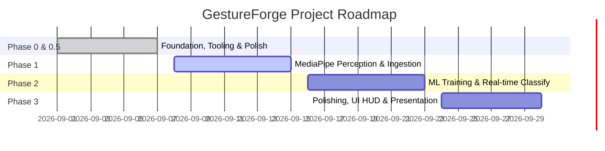

# 🗺️ GestureForge Development Roadmap

## 🎯 Purpose
Provides the strategic timeline, milestone deliverables, and handoff criteria across all development phases of GestureForge for university club selection and hackathon evaluation.

## 👤 Document Owner
- **Primary Owner**: Project Manager & Technical Lead
- **Collaborators**: All 4 Module Owners

---

## 📍 Phase Timeline

---

### ✅ Phase 0 & 0.5: Foundation, Tooling & Polish (Complete)
- [x] Establish modular repository architecture for 4-member team.
- [x] Scaffold FastAPI backend with `/health`, structured logging, and Pydantic configuration.
- [x] Modernize dependency management with `uv` and generate `uv.lock`.
- [x] Configure code quality pipelines: Ruff (linter), Black (formatter), ESLint, Prettier, Pytest.
- [x] Build React + Vite landing page with live status pinging, diagnostic command box, and HUD viewport.
- [x] Secure environment files: ignore real `.env` while tracking `.env.example`.
- [x] Standardize GitHub Actions CI, PR template with module checkboxes, and bug/feature issue templates.

---

### 🚀 Phase 1: Perception & Frame Ingestion (Next Up)
- [ ] Connect browser webcam via `navigator.mediaDevices.getUserMedia()`.
- [ ] Implement WebSocket server in FastAPI for bidirectional frame/landmark streaming.
- [ ] Initialize MediaPipe Hands in `backend/gesture.py`.
- [ ] Real-time detection and extraction of 21 3D hand landmarks.
- [ ] Render hand skeleton lines on React HUD canvas.

---

### 🧠 Phase 2: Model Training & Gesture Classification
- [ ] Record landmark coordinate datasets across 8 target gesture classes in `dataset/raw/`.
- [ ] Normalize coordinates relative to wrist anchor point to ensure scale/position invariance.
- [ ] Train multi-class classifier using Scikit-learn (Random Forest / SVM).
- [ ] Evaluate precision, recall, and confusion matrix (target >95% accuracy).
- [ ] Integrate serialized weights into `backend/models/gesture_model.py`.

---

### 🎨 Phase 3: Modern UI HUD, Sound & Presentation
- [ ] Real-time HUD overlay: dynamic bounding box, confidence percentage, gesture telemetry.
- [ ] Audio/Visual feedback cues upon recognizing distinct gestures.
- [ ] Custom gesture recorder allowing users to record custom gesture macros.
- [ ] Final performance optimization for <30ms total latency.
- [ ] Project showcase video and presentation slide deck for club selection.

---

## 🔄 Phase 1 Handoff
Criteria to transition from Phase 0.5 to Phase 1:
- [x] Zero failing tests in `pytest backend/tests`.
- [x] Zero linter errors in `ruff check .` and `eslint src`.
- [x] Frontend builds cleanly with `vite build`.
- [x] `uv.lock` committed and reproducible across team workstations.
- [ ] Team kick-off meeting to assign Phase 1 feature branches off `develop`.
