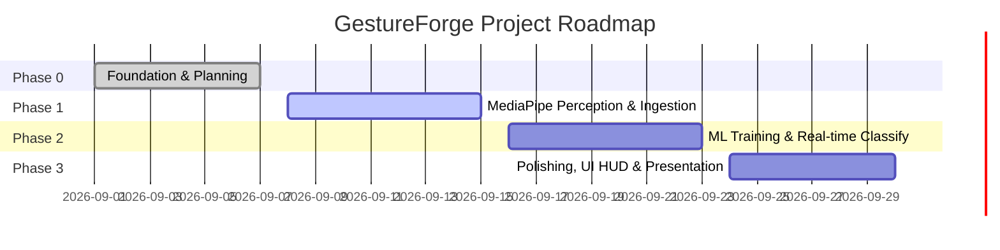

# 🗺️ GestureForge Development Roadmap

GestureForge follows an agile 4-phase milestone structure designed for university club project evaluation and hackathon execution.

---

## 📍 Phase Overview

---

### ✅ Phase 0: Foundation & Planning (Current Phase)
- [x] Establish modular repository architecture for 4-member team.
- [x] Scaffold FastAPI backend with `/health` and CORS configuration.
- [x] Scaffold React + Vite frontend with modular reusable components.
- [x] Configure CI/CD, Black formatting, ESLint, Prettier, and GitHub templates.
- [x] Define MediaPipe, Scikit-learn, and dataset contract interfaces.

---

### 🚀 Phase 1: Perception & Frame Ingestion
- [ ] Connect browser webcam via `navigator.mediaDevices.getUserMedia()`.
- [ ] Implement WebSocket server in FastAPI for bidirectional frame/landmark streaming.
- [ ] Initialize MediaPipe Hands in `backend/gesture.py`.
- [ ] Real-time detection and extraction of 21 3D hand landmarks.
- [ ] Render hand skeleton lines on React HUD canvas.

---

### 🧠 Phase 2: Model Training & Gesture Classification
- [ ] Record landmark coordinate datasets across 8 target gesture classes.
- [ ] Normalize coordinates relative to wrist anchor point to ensure scale/position invariance.
- [ ] Train multi-class classifier using Scikit-learn (Random Forest / SVM).
- [ ] Evaluate precision, recall, and confusion matrix (target >95% accuracy).
- [ ] Integrate serialized weights into `backend/models/gesture_model.py`.

---

### 🎨 Phase 3: Modern UI HUD, Sound & Final Polish
- [ ] Real-time HUD overlay: dynamic bounding box, confidence percentage, gesture telemetry.
- [ ] Audio/Visual feedback cues upon recognizing distinct gestures.
- [ ] Custom gesture recorder allowing users to record custom gesture macros.
- [ ] Final performance optimization for <30ms total latency.
- [ ] Project showcase video and presentation slide deck for club selection.
