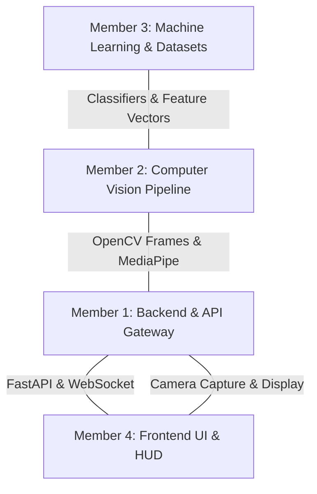

# 👥 4-Member Team Workflow & Role Matrix

To ensure maximum productivity and zero merge conflicts during a hackathon or university club sprint, GestureForge divides engineering responsibilities into four distinct domains.

---

## 🎯 Role Allocation Matrix

---

### 🟢 Member 1: Backend & API Gateway
- **Primary Domain**: `backend/app.py`, `backend/routes/`, `backend/config.py`, `.github/workflows/`
- **Key Responsibilities**:
  - FastAPI application lifecycle, routing, and configuration.
  - CORS settings, middleware, and request/response validation schemas.
  - Implement bidirectional WebSocket server for frame streaming.
  - Maintain CI/CD pipelines, containerization (Docker), and cloud deployment.
- **Contract Interface Delivered**:
  - `GET /health` -> `{"status": "ok", "service": "GestureForge Backend"}`
  - `WS /ws/gesture` -> accepts image payloads, returns recognized gesture JSON.

---

### 🔵 Member 2: Computer Vision & Preprocessing
- **Primary Domain**: `backend/gesture.py`, OpenCV integration
- **Key Responsibilities**:
  - Google MediaPipe Hands model integration and parameter tuning.
  - Frame decoding, color space transformation (BGR -> RGB), and orientation handling.
  - Landmark extraction (21 3D landmarks per hand) and multi-hand detection.
  - Frame debug rendering (overlaying skeleton lines and joint dots on video feeds).
- **Contract Interface Delivered**:
  - `extract_landmarks(frame: np.ndarray) -> List[HandDetectionResult]`

---

### 🟣 Member 3: Machine Learning & Datasets
- **Primary Domain**: `backend/models/`, `dataset/`
- **Key Responsibilities**:
  - Design dataset collection protocol and collect gesture samples (`dataset/raw/`).
  - Feature engineering: landmark translation relative to wrist, scale normalization.
  - Model training (Scikit-Learn Random Forest / SVM / KNN) with cross-validation.
  - Model serialization to `backend/models/gesture_classifier.joblib`.
  - Benchmark inference latency and classification accuracy metrics (>95% accuracy target).
- **Contract Interface Delivered**:
  - `predict(feature_vector: np.ndarray) -> {"gesture": str, "confidence": float}`

---

### 🟠 Member 4: Frontend UI & HUD Experience
- **Primary Domain**: `frontend/` (`App.jsx`, `components/`, `index.css`)
- **Key Responsibilities**:
  - React + Vite application state management and styling.
  - Web camera access via `navigator.mediaDevices.getUserMedia()`.
  - Real-time HUD layout: confidence meters, bounding boxes, gesture label cards.
  - Latency and backend connection diagnostics (`StatusCard.jsx`).
  - Polished visual aesthetics (dark mode, glassmorphism, micro-animations).
- **Contract Interface Delivered**:
  - Responsive web dashboard running at `http://localhost:5173`.

---

## 🤝 Branching & Pull Request Rules

1. **Never commit directly to `main`**.
2. **Branch Naming Standard**:
   - `feat/backend-websocket-m1`
   - `feat/mediapipe-landmarks-m2`
   - `feat/classifier-training-m3`
   - `feat/frontend-hud-m4`
   - `fix/cors-origin-issue`
3. **Pull Request Protocol**:
   - Fill out `.github/PULL_REQUEST_TEMPLATE.md`.
   - Require at least 1 team member review and all CI checks green before merging.
