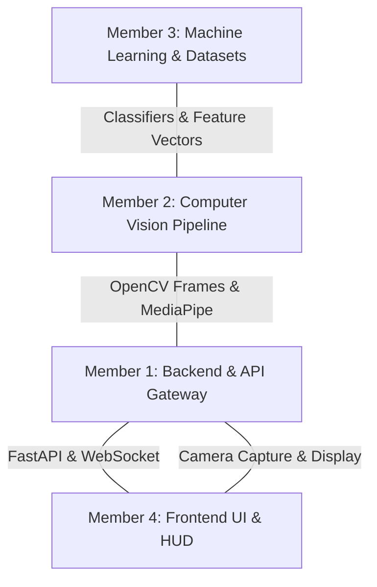

# 👥 4-Member Team Workflow & Role Matrix

## 🎯 Purpose
Defines the functional specialization, input/output contract interfaces, and branching governance for a 4-member hackathon / university club selection team to work concurrently with zero merge friction.

## 👤 Document Owner
- **Primary Owner**: Team Lead & All 4 Core Contributors
- **Sign-off**: Member 1, Member 2, Member 3, Member 4

---

## 🎯 Role Allocation Matrix



---

### 🟢 Member 1: Backend & API Gateway
- **Primary Domain**: `backend/app.py`, `backend/routes/`, `backend/config.py`, `.github/workflows/`
- **Key Responsibilities**:
  - FastAPI application lifecycle, routing, and Pydantic configuration.
  - CORS policies, structured logging middleware, and latency benchmarks.
  - WebSocket protocol implementation for high-throughput video frame ingestion.
  - Maintain GitHub Actions CI, `uv` dependency locking, and test suites.
- **Contract Interface Delivered**:
  - `GET /health` -> `{"status": "ok", "service": "GestureForge Backend"}`
  - `WS /ws/gesture` -> accepts image payloads, streams back recognized gesture JSON events.

---

### 🔵 Member 2: Computer Vision & Preprocessing
- **Primary Domain**: `backend/gesture.py`, OpenCV integration
- **Key Responsibilities**:
  - Google MediaPipe Hands solution integration and pipeline tuning.
  - Frame decoding, color space transformation (BGR -> RGB), and orientation handling.
  - 21 3D hand landmark keypoint extraction with normalized coordinate outputs.
  - Landmark skeleton drawing utilities for video debug mode.
- **Contract Interface Delivered**:
  - `extract_landmarks(frame: np.ndarray) -> list[HandDetectionResult]`

---

### 🟣 Member 3: Machine Learning & Datasets
- **Primary Domain**: `backend/models/`, `dataset/`
- **Key Responsibilities**:
  - Coordinate dataset curation across 8 target gesture classes in `dataset/raw/`.
  - Landmark feature normalization (wrist-relative translation & scale invariance).
  - Train Scikit-learn multi-class classifiers (Random Forest / SVM / KNN).
  - Model serialization to `backend/models/gesture_classifier.joblib`.
  - Validate model metrics (achieve >95% cross-validation accuracy).
- **Contract Interface Delivered**:
  - `predict(feature_vector: np.ndarray) -> {"gesture": str, "confidence": float}`

---

### 🟠 Member 4: Frontend UI & HUD Experience
- **Primary Domain**: `frontend/` (`App.jsx`, `components/`, `index.css`)
- **Key Responsibilities**:
  - React + Vite dashboard state management, accessibility, and visual polish.
  - Browser camera stream integration via `navigator.mediaDevices.getUserMedia()`.
  - Real-time HUD layout: confidence meters, bounding boxes, gesture label cards.
  - Network diagnostics and WebSocket event rendering.
- **Contract Interface Delivered**:
  - Responsive web dashboard running at `http://localhost:5173`.

---

## 🌿 Git Branching Strategy

We follow an adapted GitHub Flow off `develop`:

```
main (Production / Stable)
 └── develop (Staging & Integration)
      ├── feat/backend-websocket-m1
      ├── feat/mediapipe-landmarks-m2
      ├── feat/classifier-training-m3
      └── feat/frontend-hud-m4
```

1. Create a feature branch off `develop`:
   ```bash
   git checkout -b feat/<module-name>-<member-initials>
   ```
2. Commit with Conventional Commits format (`feat:`, `fix:`, `docs:`, `chore:`).
3. Open a Pull Request using `.github/PULL_REQUEST_TEMPLATE.md`.
4. Ensure all CI checks pass (`ruff`, `black`, `pytest`, `npm run build`) and obtain at least 1 peer review before merging.

---

## 🔄 Phase 1 Handoff
Team members start their respective Phase 1 tasks under the following contract obligations:
- **M1 & M2**: M1 provides WebSocket endpoint; M2 feeds decoded OpenCV frames into `HandGestureRecognizer`.
- **M2 & M3**: M2 provides the 21 normalized landmarks schema to M3 for dataset recording.
- **M1 & M4**: M1 specifies the WebSocket JSON telemetry event format for M4 to render on the HUD.
